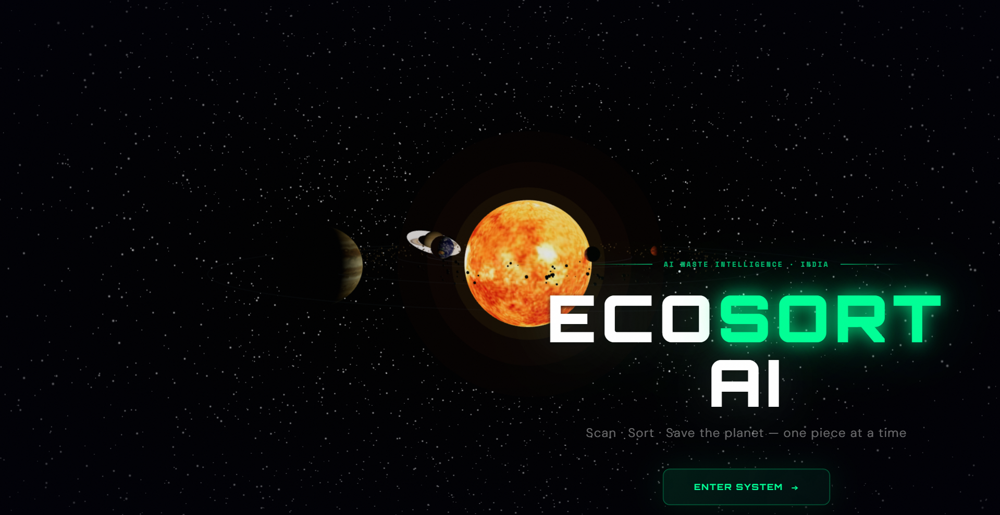
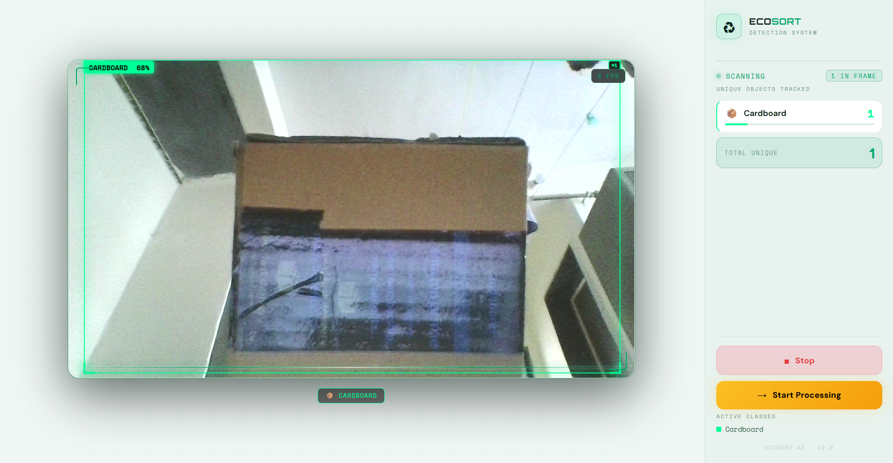
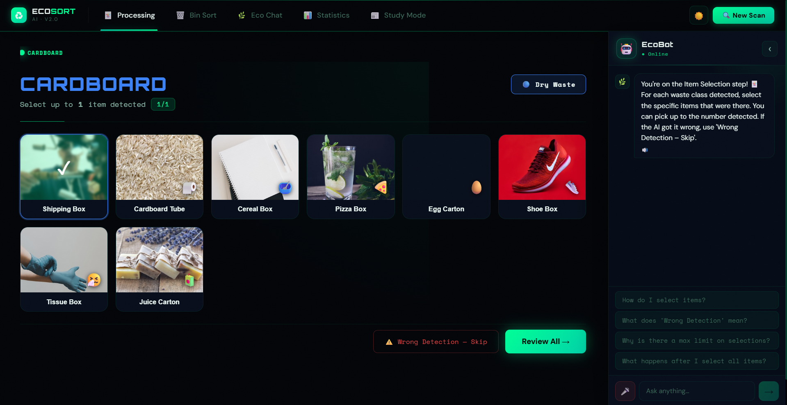
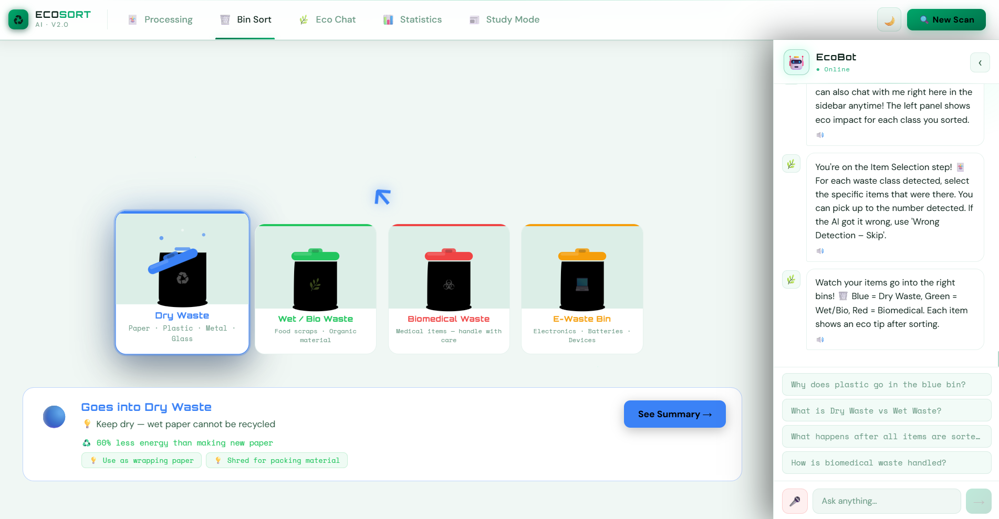
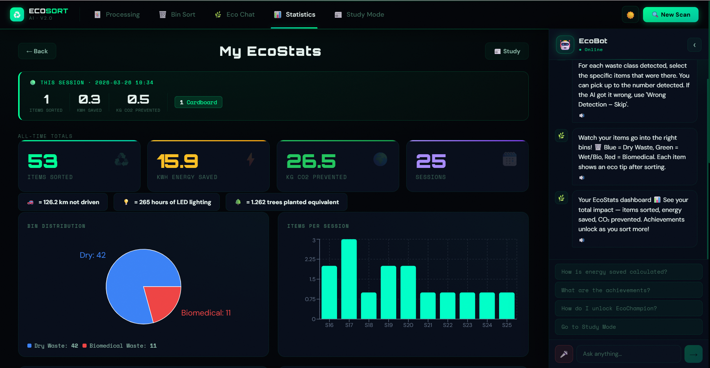
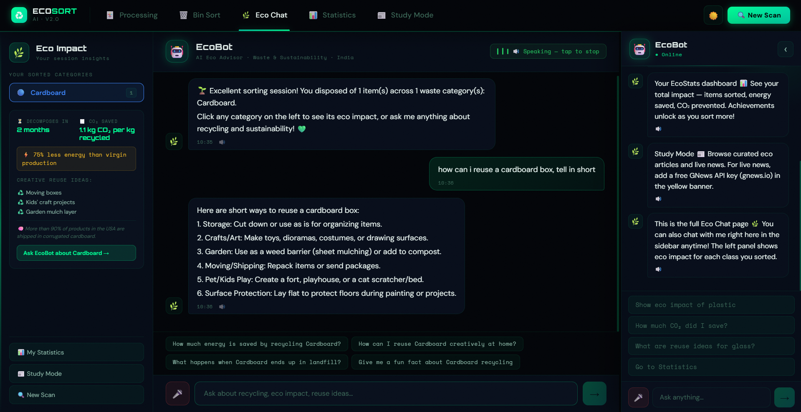
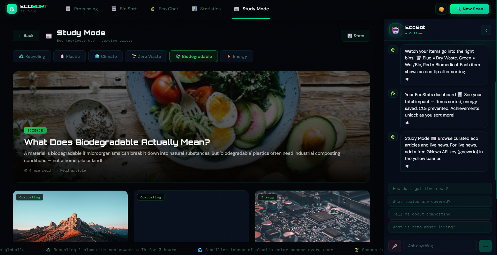

# 🚀 EcoSort AI – Intelligent Waste Detection & Smart Sorting System

> AI-powered waste management system using Computer Vision + LLM to detect, classify, and guide waste disposal in real time.

---

## 📸 Screenshots

### 🏠 Landing Page


### 🎯 Detection (Real-Time)


### 🧠 Processing & Validation


### 🗑️ Sorting Guidance


### 📊 Statistics Dashboard


### 🤖 EcoBot (AI Assistant)


### 📚 Study Mode


---

## 📌 Overview

EcoSort AI is a full-stack AI system that performs real-time waste detection and intelligent sorting guidance using a custom-trained YOLOv8 model and an LLM-powered assistant.

---

## 🧠 Key Features

- ♻️ Real-time multi-object waste detection  
- 📦 Multi-class classification (plastic, paper, metal, glass, etc.)  
- 🧑‍💻 Human-in-the-loop validation for accuracy  
- 🗑️ Smart bin sorting recommendations  
- 📊 Environmental impact statistics dashboard  
- 🤖 LLM-powered EcoBot (Gemini 2.5 Flash)  
- 🎤 Voice input and output interaction  
- 📚 Study mode with eco-awareness content  
- 🌗 Dark/Light theme support  

---

## 🧠 Model Details

- Model: YOLOv8l (Ultralytics)  
- Dataset: ~22,000 images (Roboflow)  
- Classes: 8 waste categories  
- Performance: mAP50 ≈ 0.76  

---

## 🛠️ Tech Stack

- Frontend: React.js, JavaScript, CSS  
- Backend: FastAPI (Python)  
- AI/ML: YOLOv8, OpenCV  
- LLM: Gemini 2.5 Flash  

---

## 📦 Data Storage

- sessionStorage is used for temporary session data (current scan and processing state)  
- localStorage is used for persistent storage of all-time statistics and session history  
- Enables data persistence across browser sessions without requiring a backend database  
- Designed for lightweight, single-user usage  

---

## ⚙️ Setup Instructions

### 1. Clone the repository
```bash
git clone https://github.com/your-username/ecosort-ai.git
cd ecosort-ai

### 2. Backend
```bash
cd backend
pip install -r requirements.txt
uvicorn api:app --reload

### 3. Frontend
```bash
cd frontend
npm install
npm start

### 4. Environment Variables

Create a .env file in the backend folder:

GEMINI_API_KEY=your_api_key_here
## 🔄 System Flow

Landing → Detection → Processing → Sorting → Stats → Study Mode + EcoBot

## 🚧 Challenges Solved
Improved model accuracy through dataset refinement
Handled incorrect detections using validation step
Fixed UI alignment and rendering issues
Integrated real-time detection with frontend

## 📈 Future Scope
Mobile application
IoT-based smart bins
Improved model accuracy
Cloud deployment

## 👤 Author

Vitthal More
B.Tech – VIT Pune

## ⭐ Support

If you like this project, consider giving it a star ⭐