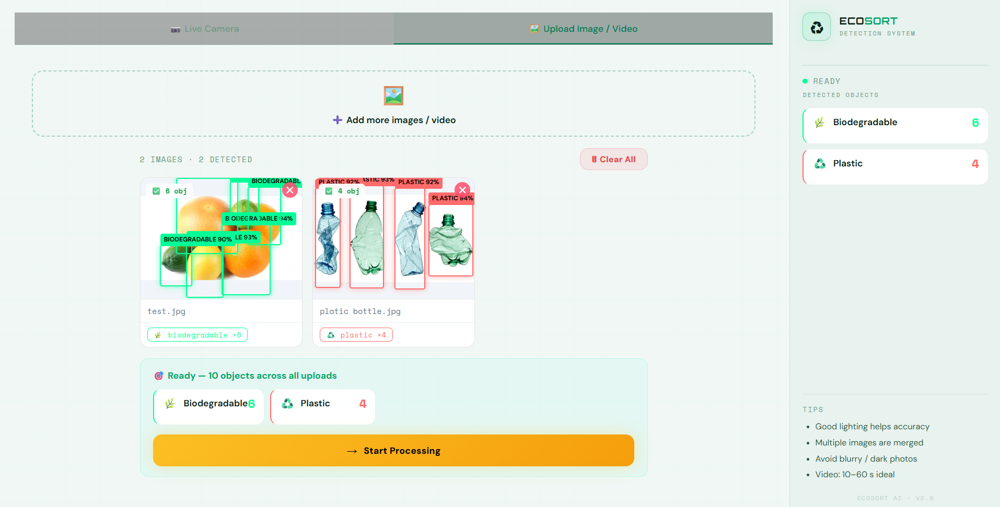

# ♻️ EcoSort AI – Intelligent Waste Detection & Smart Sorting System

> AI-powered waste management platform that detects, classifies, and guides waste disposal in real time using Computer Vision, Deep Learning, and Large Language Models.

---

# 📌 Overview

EcoSort AI is a full-stack AI application designed to improve waste segregation through real-time object detection and intelligent disposal guidance.

The system combines a custom-trained YOLOv8 model with an LLM-powered assistant to help users:
- identify waste categories,
- validate detections,
- receive smart disposal recommendations,
- track environmental impact,
- and maintain personal waste management statistics.

EcoSort AI supports both **live camera detection** and **image upload-based detection**, making the platform flexible and accessible across different use cases.

---

# ✨ Features

## ♻️ AI Waste Detection
- Real-time waste detection using webcam
- Image upload-based waste detection
- Multi-object detection and classification
- Bounding-box visualization with confidence scores
- Detection deduplication and object tracking

## 🧠 Intelligent Processing
- Human-in-the-loop validation workflow
- Smart waste sorting recommendations
- Waste-bin guidance system
- Environmental impact calculations

## 👤 User System
- User authentication (Login / Signup)
- Protected routes and secure sessions
- Persistent user statistics and scan history
- Cloud-based data storage using MongoDB Atlas

## 📊 Analytics Dashboard
- Session-wise waste statistics
- CO₂ savings tracking
- Energy savings calculations
- Recycling insights and achievements
- PDF and CSV export support

## 📍 Smart Recycling Assistance
- Nearby recycling / garbage disposal center suggestions
- Distance-aware recommendations
- Google Maps integration for navigation

## 🤖 AI Assistant
- EcoBot powered by Gemini 2.5 Flash
- Eco-awareness guidance
- Sustainability education support

## 🎨 User Experience
- Dark / Light theme support
- Animated modern UI
- Responsive design
- Interactive dashboard experience

---

# 🧠 AI & Model Details

| Component | Details |
|---|---|
| Detection Model | YOLOv8l (Ultralytics) |
| Dataset Size | ~22,000 Images |
| Dataset Source | Roboflow |
| Waste Categories | 8 Classes |
| Model Performance | mAP50 ≈ 0.76 |
| LLM Integration | Gemini 2.5 Flash |

---

# 🗂️ Supported Waste Categories

- Plastic
- Paper
- Glass
- Metal
- Cardboard
- Organic Waste
- Medical Waste
- E-Waste
- Biodegradable Waste

---

# 🛠️ Tech Stack

## Frontend
- React.js
- JavaScript
- CSS
- Framer Motion

## Backend
- FastAPI
- Node.js
- Express.js

## AI / ML
- YOLOv8
- OpenCV
- NumPy

## Database
- MongoDB Atlas

## Authentication
- bcrypt.js

## LLM Integration
- Gemini 2.5 Flash

---

# 🏗️ System Architecture

```text
EcoSort_AI
│
├── React Frontend
│     ├── Live Detection UI
│     ├── Image Upload Detection
│     ├── Statistics Dashboard
│     ├── EcoBot Chat Interface
│     └── Study Mode
│
├── FastAPI Backend
│     ├── YOLOv8 Inference
│     ├── Real-time Detection
│     ├── Image Processing
│     └── Gemini AI Integration
│
└── Node.js + Express Backend
      ├── Authentication System
      ├── User Session Storage
      ├── Statistics Management
      └── MongoDB Atlas Integration
```

---

# 📸 Screenshots

## 🏠 Landing Page


## 🎯 Real-Time Detection


## 🖼️ Image Upload Detection


## 🧠 Processing & Validation


## 🗑️ Sorting Guidance


## 📊 Statistics Dashboard


## 🤖 EcoBot Assistant


## 📚 Study Mode


---

# 📂 Project Structure

```text
EcoSort_AI/
│
├── backend/
│   ├── api.py
│   ├── gemini_api.py
│   ├── model.py
│   ├── server.js
│   ├── requirements.txt
│   └── package.json
│
├── frontend/
│   ├── public/
│   ├── src/
│   └── package.json
│
├── assets/
├── README.md
└── .gitignore
```

---

# ⚙️ Installation & Setup

## 1️⃣ Clone the Repository

```bash
git clone https://github.com/vitthal-hash/Ecosort_AI.git
cd Ecosort_AI
```

---

## 2️⃣ Backend Setup (FastAPI + AI Server)

```bash
cd backend

pip install -r requirements.txt

uvicorn api:app --reload --port 8000
```

AI backend runs on:

```bash
http://127.0.0.1:8000
```

---

## 3️⃣ Backend Setup (Node.js Server)

Open another terminal:

```bash
cd backend

npm install

node server.js
```

Node backend runs on:

```bash
http://localhost:5000
```

---

## 4️⃣ Frontend Setup

Open another terminal:

```bash
cd frontend

npm install

npm start
```

Frontend runs on:

```bash
http://localhost:3000
```

---

# 🔑 Environment Variables

Create a `.env` file inside the `backend` folder:

```env
MONGO_URI=your_mongodb_atlas_url
GEMINI_API_KEY=your_gemini_api_key
PORT=5000
```

---

# 🔄 Application Workflow

```text
Landing Page
      ↓
Authentication
      ↓
Detection (Camera / Upload)
      ↓
Processing & Validation
      ↓
Smart Sorting Guidance
      ↓
Statistics Dashboard
      ↓
Study Mode + EcoBot
```

---

# 📊 Core Functionalities

## 🔍 Detection Pipeline
- Real-time webcam inference
- Upload image detection
- Multi-object tracking
- Confidence-based prediction display

## 📦 Smart Sorting
- Waste classification
- Bin recommendation engine
- Recycling guidance
- Disposal safety recommendations

## 📈 Environmental Analytics
- CO₂ reduction calculations
- Energy savings estimation
- Recycling statistics
- Session history tracking

## 📍 Smart Location Support
- Nearby disposal/recycling center discovery
- Distance-based recommendations
- Google Maps navigation support

---

# 🚧 Challenges Solved

- Improved model accuracy through dataset refinement
- Reduced false detections using validation workflows
- Integrated real-time AI inference with frontend
- Built scalable multi-backend architecture
- Implemented persistent cloud-based statistics storage
- Added secure authentication and protected routes
- Optimized UI responsiveness and rendering performance

---

# 📈 Future Improvements

- 📱 Mobile application support
- ☁️ Cloud deployment
- 🛰️ IoT-integrated smart bins
- 🌍 Multi-language support
- 🧠 Improved model accuracy with larger datasets
- 🔔 Smart waste collection alerts
- 📡 Real-time municipal waste integration

---

# 👨‍💻 Author

**Vitthal More**  
B.Tech – VIT Pune

GitHub:  
https://github.com/vitthal-hash

---

# ⭐ Support

If you found this project useful, consider giving it a ⭐ on GitHub.

Contributions, suggestions, and feedback are always welcome.